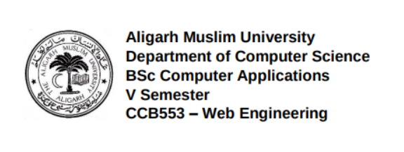

# Attendance Management System
Prepared by: 
  
Haris Moin (20CAB106) & Aryaman Gupta (20CAB115) 

Dated: <i> 26th October 2022   </i>

 
 
1. Introduction
Attendance Management System is a web application developed for daily student attendance in colleges. If facilitates to access the attendance information of a particular student in a particular class. The attendance will be marked by the teachers for a particular class. Each teacher will be given a separate user name and password. This system will also help in evaluating attendance eligibility criteria of a student. Automatic reports on student’s attendance will be generated at the end of session or in between of the session.

Here the 
staffs, who are handling the subjects, will be responsible to mark the attendance of the 
students.  Each  staff  will  be given with a  separate  username and password  based on 
the  subject  they  handle
Here the 
staffs, who are handling the subjects, will be responsible to mark the attendance of the 
students.  Each  staff  will  be given with a  separate  username and password  based on 
the  subject  they  handle
Here the 
staffs, who are handling the subjects, will be responsible to mark the attendance of the 
students.  Each  staff  will  be given with a  separate  username and password  based on 
the  subject  they  handle
Here the 
staffs, who are handling the subjects, will be responsible to mark the attendance of the 
students.  Each  staff  will  be given with a  separate  username and password  based on 
the  subject  they  handle.
Here the 
staffs, who are handling the subjects, will be responsible to mark the attendance of the 
students.  Each  staff  will  be given with a  separate  username and password  based on 
the  subject  they  handle.
Here the 
staffs, who are handling the subjects, will be responsible to mark the attendance of the 
students.  Each  staff  will  be given with a  separate  username and password  based on 
the  subject  they  handle.
Here the 
staffs, who are handling the subjects, will be responsible to mark the attendance of the 
students.  Each  staff  will  be given with a  separate  username and password  based on 
the  subject  they  handle.
Here the 
staffs, who are handling the subjects, will be responsible to mark the attendance of the 
students.  Each  staff  will  be given with a  separate  username and password  based on 
the  subject  they  handle.
Here the 
staffs, who are handling the subjects, will be responsible to mark the attendance of the 
students.  Each  staff  will  be given with a  separate  username and password  based on 
the  subject  they  handle.
Here the 
staffs, who are handling the subjects, will be responsible to mark the attendance of the 
students.  Each  staff  will  be given with a  separate  username and password  based on 
the  subject  they  handle.
Here the 
staffs, who are handling the subjects, will be responsible to mark the attendance of the 
students.  Each  staff  will  be given with a  separate  username and password  based on 
the  subject  they  handle.
Here the 
staffs, who are handling the subjects, will be responsible to mark the attendance of the 
students.  Each  staff  will  be given with a  separate  username and password  based on 
the  subject  they  handle.
Here the 
staffs, who are handling the subjects, will be responsible to mark the attendance of the 
students.  Each  staff  will  be given with a  separate  username and password  based on 
the  subject  they  handle.
Here the 
staffs, who are handling the subjects, will be responsible to mark the attendance of the 
students.  Each  staff  will  be given with a  separate  username and password  based on 
the  subject  they  handle.
1.1 Purpose 
The purpose of this SRS document is to specify the application requirements of the Attendance Management System. It will explain the purpose and features of the application, the interfaces of the application, what the application will do, the constraints under which it must operate and how the software will react to external stimuli. This document is intended for both the end users and the developers of the application.

This project aims to computerize the traditional attendance system where attendance is marked manually. Digitalization of the system would also help in better visualization of the data using graphs to display the no. of students’ attendance records, and total classes attended by each student. Its added features serve as an efficient upgrade and replacement for the traditional attendance system.

1.2 Document Conventions
This document uses Times font with font size 12 throughout the document for text. Use italics for comments. Document text is single spaced and maintains 1” margins on all four sides.

1.3 Intended Audience and Reading Suggestions
The intended audience is the  engineering class, who will be implementing and testing the
Attendance Management System. Also, the document is to be utilized by the  engineering 
professor to
evaluate the software’s design and features
The intended audience is the  engineering class, who will be implementing and testing the
Attendance Management System. Also, the document is to be utilized by the  engineering 
professor to
evaluate the software’s design and features
The intended audience is the  engineering class, who will be implementing and testing the
Attendance Management System. Also, the document is to be utilized by the  engineering 
professor to
evaluate the software’s design and features
The intended audience is the  engineering class, who will be implementing and testing the
Attendance Management System. Also, the document is to be utilized by the  engineering 
professor to
evaluate the software’s design and features
This document covers the requirements for the building and using the web-based application for Attendance Management System. The document’s intended audience is the developers of this web application who will be implementing and testing the Attendance Management System. Also, the document is to be utilized by the professor who will be evaluating the application’s design and features as well as the professors who will be using this Attendance Management System to take attendance on a daily basis and generate reports.

The intended audience is the  engineering class, who will be implementing and testing the
Attendance Management System. Also, the document is to be utilized by the  engineering 
professor to
evaluate the software’s design and features
The intended audience is the  engineering class, who will be implementing and testing the
Attendance Management System. Also, the document is to be utilized by the  engineering 
professor to
evaluate the software’s design and features
The intended audience is the  engineering class, who will be implementing and testing the
Attendance Management System. Also, the document is to be utilized by the  engineering 
professor to
evaluate the software’s design and features
1.4 Product Scopes
This system allows the teacher to maintain an attendance record of the classes to which he/she is teaching. With the help of this system, teachers should be in a position to generate a cumulative report for a student’s attendance for the session that has collapsed yet. Even students can access their attendance status. A better interpretation of records using graphs is a key feature of this application. The goal is to provide the professors an easy, portable solution to attendance record maintenance and attendance statistics.

References

    • The document is designed based on the format provided by IEEE: IEEE Software Requirement Template.
2. Overall Description
2.1 Product Perspective
The Attendance Management System is intended to replace the manual model of attendance 
record keeping by
means of roll call and paper records. The roll call and paper records are replaced with a single 
interaction
between the professor and the Attendance Management System. Professors will be able to 
view details regarding attendance of individual students on their  PC and quickly maintain 
attendance records. The features expressed in this Software Requirements Specification 
document are intended to be fully implemented in version 1.0. The
system will be developed in such a way to provide easy addition of enhanced features, which 
may be
desired in subsequent versions
The Attendance Management System is intended to replace the manual model of attendance 
record keeping by
means of roll call and paper records. The roll call and paper records are replaced with a single 
interaction
between the professor and the Attendance Management System. Professors will be able to 
view details regarding attendance of individual students on their  PC and quickly maintain 
attendance records. The features expressed in this Software Requirements Specification 
document are intended to be fully implemented in version 1.0. The
system will be developed in such a way to provide easy addition of enhanced features, which 
may be
desired in subsequent versions
The Attendance Management System is intended to replace the manual model of attendance 
record keeping by
means of roll call and paper records. The roll call and paper records are replaced with a single 
interaction
between the professor and the Attendance Management System. Professors will be able to 
view details regarding attendance of individual students on their  PC and quickly maintain 
attendance records. The features expressed in this Software Requirements Specification 
document are intended to be fully implemented in version 1.0. The
system will be developed in such a way to provide easy addition of enhanced features, which 
may be
desired in subsequent versions
The Attendance Management System is intended to replace the manual model of attendance 
record keeping by
means of roll call and paper records. The roll call and paper records are replaced with a single 
interaction
between the professor and the Attendance Management System. Professors will be able to 
view details regarding attendance of individual students on their  PC and quickly maintain 
attendance records. The features expressed in this Software Requirements Specification 
document are intended to be fully implemented in version 1.0. The
system will be developed in such a way to provide easy addition of enhanced features, which 
may be
desired in subsequent versions
The attendance maintenance system replaces the traditional, manual attendance system, which reduces a lot of paperwork. The teacher should be able to easily mark each student’s attendance and view attendance records on his/her laptop. This is the primary feature of this system. Student can also see their attendance stats by entering information such as roll no, course code, section and year of the course. They will get a visual representation of their attendance.

The feature expressed in this Software Requirements Specification document are intended to be full implemented in version 1.0 The system will be developed in such a way to provide easy addition of enhanced features, which may be desired in subsequent versions.

2.2 Product Functions
    • The main feature of the Attendance Management System is that it keeps the attendance records of each individual student. 
    • At the end of the specified period reports are generated.
    • Teachers can easily mark the attendance for the students.
    • The system allows the teachers and the students to view the pertinent statistics on student’s attendance records for the specified class.

2.3 User Classes and Characteristics
There are primarily two users that would be using the application: 

Professors/Teachers: A professor or the teacher is a faculty member of the college. There are many faculty members in the institution and it is estimated that almost all the members are going to utilize the Attendance Management System. Now each professor can have one or more than one class. Their interaction with the system will be almost on daily basis. The professors are allowed to view the attendance record of any student at any time.

Student: The number of students will be obviously greater than the number of professors accessing the application. They can access their current attendance status at any time. However, they can’t make any changes to the records. They can just view them.
2.4 Operating Environment
OE-1:	Like other web 2.0 applications, this Attendance Management system requires internet connection and a device such as smartphone or personal computer to access the web page.

OE-2:	The Web Server and the Database Software have not been established at this point.

2.5 Design and Implementation Constraints
CO-1:	The time allotted for this project will be limited to the end of this semester.

CO-2:	The language for the project will be HTML 5, CSS 3 for the frontend JavaScript and PHP for the backend.

2.6 Assumptions and Dependencies
AS-1:	The database mentioned withing this Software Requirements Specification document is previously administered with the correct information needed by the Attendance Management System.

AS-2:	For attendance policies, since the professors do not usually tabulate tardiness, it is assumed that a student is either present or absent. 

AS-3:	The system also assumes the detail regarding each student would be made correctly.

DE-1:	Class data being used for setup and student recognition is dependent on the information database administered outside of the capabilities of the Attendance Management System.

DE-2:	Statistics on student attendance are dependent on a professor’s consistent utilization of the system or each lecture.
3. External Interface Requirements
3.1 User Interfaces
UI-1:	The application will provide the list of students’ roll no.

UI-2:	Each student will be marked absent by default. Teacher has to do a mouse click to change the status to present.

UI-3:	Clicking on a student’s roll no. will get that students attendance stats that will displayed in the form of a cumulative bar graph.

UI-4:	The application will be accessed through a browser.
3.2 Hardware Interfaces
Server Side:
Client Side: 
3.3 Software Interfaces
SI-1: Attendance Management System

SI-1.1: This application will transmit the attendance of a class to a database on a machine via internet.

SE-1.2: The user (teacher) will be allowed to enter the records. They cannot modify the attendance records.

SI-2: Database

The Attendance management system will interact with the database to perform the following operations: 

SI-2.1:  To allow user to enter attendance.

SI-2.2: To allow user to query  a system to gain statistics concerning individual and class ………...attendance.
3.4 Communications Interfaces
CI-1:	The security of a user must be consistent through the use of passwords.

CI-2:	The attendance management system will communicate to the database through Internet.
4. System Features
4.1 Mark Students Attendance
4.1.1	Description and Priority
The most important feature of this application is to mark the attendance of students present in a particular lecture of a particular class.
4.1.2	Stimulus/Response Sequences
By default, each student will be marked absent. It is required by the teacher, the primary user of the application to toggle that with a single click using the mouse.
4.1.3	Functional Requirements
REQ-1:	Teacher should mark the attendance of student with accuracy. 
REQ-2:	Loud and clear roll calls should be made by the teacher and a similar response must be received from the students for efficiency.
4.2 Display Attendance Records
4.2.1	Description and Priority
The second most important feature of this application is that teacher as well as student can view the attendance status.
4.2.2	Stimulus/Response Sequences
A teacher can view the attendance performance of any student by simply logging in to their account and opening the class for which they want to view the status and then simply clicking at the students roll number whose attendance they want to view.
Student can enter their roll number, class code and other necessary details to get their attendance.
4.2.3	Functional Requirements
REQ-1:	Teacher should be consistent with using the application, so that attendance is calculated accurately.
REQ-2:	Correct details must be entered by the student who wants to view their attendance. 

5. Other Nonfunctional Requirements
5.1 Performance Requirements
PE-1:	The program must be able to run concurrently by the multiple professors during peak times of usage that is 9:00 AM to 2:00 PM.

PE-2:	Transmission of roll data should occur in under 5 seconds.

PE-3:	Queries upon the database shall be performed in less than 5 seconds.

PE-4:	The program shall support taking roll for class sizes of up to 100 students. With a
               maximum class size, performance must still conform to all performance 
requirements
The program shall support taking roll for class sizes of up to 100 students. With a
               maximum class size, performance must still conform to all performance 
requirements
The program shall support taking roll for class sizes of up to 100 students. With a
               maximum class size, performance must still conform to all performance 
requirements.
PE-4:	The program shall support taking roll for class sizes of up to 100 students. With a maximum class size, performance must still conform to all performance requirements.

maximum class size, performance must still conform to all performance 
requirements
5.2 Security Requirements
SR-1:	An instructor shall be permitted to view and edit presence information in the database for only his/her class.

SR-2:	In order to take the roll, the instructor shall be required to enter a password and log in to their account first.

SR-3:	Passwords shall be stored in the instructor’s database and verified upon each session of logging in.
5.3 Software Quality Attributes

Availability-1:    The system shall be available to all instructors through Information Systems 
during their
                           normal hours of operation.
Reliability-1:      Due to the use of a wireless network, reliability of the system at all times is 
not
                           guaranteed. However, overall reliability of the system and roll information 
shall be
                           achieved through the process of database manipulation.
Reusability-1:     The system shall be able to be reused for each new semester.
Robustness-1:     If no network connection can be established to receive the roll information, 
the instructor
                           shall be allowed to enter roll later.
Robustness-2:     If a network connection is lost during roll, the program shall allow the 
instructor to
                           transmit roll information at a later time.
Updatability-1:  The system
Availability-1:	 The system shall be available to all instructors through Information Systems during their normal hours of operation.

Reliability-1:	Due to the use of a wireless network, the reliability of the system at all times is not guaranteed. However, the overall reliability of the system and roll information shall be achieved through the process of database manipulation.

Reusability-1:	The system shall be able to be reused for each new semester.

Robustness-1:	If no network connection can be established to receive the roll information, the instructor shall be allowed to enter the roll later.

Robustness-2:	If a network connection is lost during the roll, the program shall allow the instructor to transmit roll information at a later time.

Updatability-1: The system shall allow for the addition or deletion of instructors, students, 
and classes while incorporating new semesters.

Usability-1:	Usability of the system shall be achieved through online help pages and an introductory training session for all instructors.
Appendix A: Glossary

AS
Assumptions
CI
Communication Interface
DB
Database
OE
Operating Environment
PI
Performance Requirements
SI
Software Interface
SQL
Structured Query Language
SR
Security Requirements
SRS
Software Requirement Specification
UI
User Interface

 
